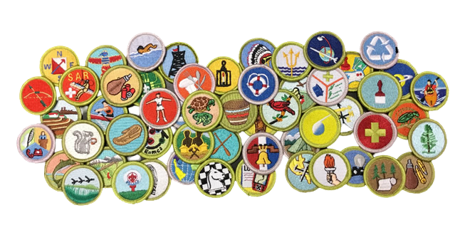

Requirement #2: Merit Badge
+++++++++++++++++++++++++++

:math:`\boxed{\mathbb{REQ}\Large \rightsquigarrow}` Complete ONE merit badge from the following list. Choose one that you have not already used toward another Nova award.
After completion, discuss with your counselor the genetic component of the merit badge you selected.

* Animal Science	
* Bird Study	
* Forestry	
* Gardening	
* Insect Study	
* Mammal Study	
* Medicine	
* Nature                                      
* Public Health		     
* Reptile and Amphibian Study  
* Veterinary Medicine	     

   

.. attention:: Once you have completed this requirement, make sure you document it in your worksheet!
