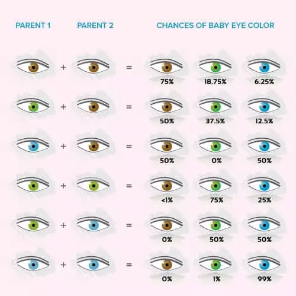

Requirement #3: Hands-on activities
+++++++++++++++++++++++++++++++++++

:math:`\boxed{\mathbb{REQ}\Large \rightsquigarrow}` Complete two of the following activities:

A. Teach the basics of genetic inheritance to your patrol (or similar group), using gummy bear genetics or a similar method.

   .. tip:: Helpful Link: `Making Mendel's Model Manageable <https://my.nsta.org/resource/5243/making-mendels-model-manageable>`_
	    
B. Extract DNA from saliva, strawberries, or a banana.
C. Grow at least three generations of pea plants and explain the inheritance patterns.

   .. tip:: Helpful Link: `Gregor Mendel's Pea Plant Experiment <http://science.lovetoknow.com/life-sciences/gregor-mendels-pea-plant-experiment>`_

D. Create a three-dimensional model of DNA and explain how it leads to the production of proteins.

   
   Example on how genetics determines a baby eyes' color. Image obtained from the https://www.momjunction.com/baby-eye-color-calculator/  website. 

.. attention:: Once you have completed this requirement, make sure you document it in your worksheet!
