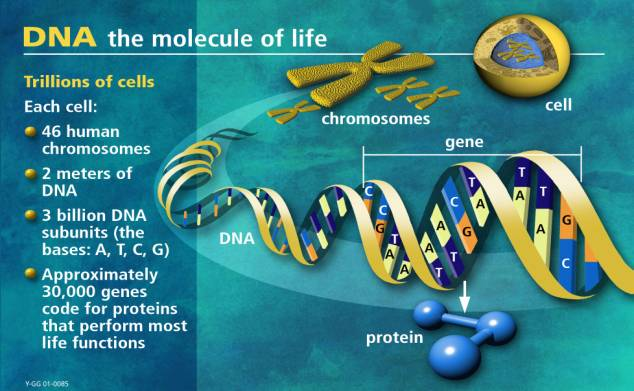

Requirement #4: Research
++++++++++++++++++++++++

		

   Image describing the Human Genome Project. This image was obtained from https://novaonline.nvcc.edu/eli/evans/his135/events/genome00/genome00.html
   
:math:`\boxed{\mathbb{REQ}\Large \rightsquigarrow}` Present a report of at least 800 words or 10 minutes (with visual aids) on one of the following opics. Make sure to include the ethical issues involved in your topic. If possible, present our report to your unit or another group in addition to presenting to your counselor.

   A. Mendelian inheritance, DNA, RNA, genetics, genomics, sequencing, and Punnett squares
   B. Genetic diseases, personalized medicine, and genetic counseling
   C. Genetically modified food, transgenic animals, and hybrid foods
   D. Use of large genetics databases for forensic analysis/solving crimes, genealogical research, or medical studies (The Cancer Genome Atlas (TCGA), Catalogue of Somatic Mutations in Cancer (COSMIC), Exome Aggregation Consortioum (ExAC), 100,000 Genomes Project, mitochondria! DNA, etc.)
   E. Pharmacogenetics and oncogenomics
   F. Human Genome Project
   G. CRISPR (Clustered Regularly-Interspaced Short Palindromic Repeats)
   H. Biotechnology, biologics, and biosimilar drugs
   I. Another related topic approved by your counselor in advance

.. admonition:: Additional Challenge

   *Britannica kids* has an excellent introduction to **genetic engineering** website you can find `here <https://kids.britannica.com/kids/article/genetic-engineering/600760>`_ where you can learn more about how it may be used to create helpful medical substances, such as vaccines. 

   
.. Note:: CRISPR
	   Did you know that Nobel Prize in Chemistry in 2020 was awarded to Dr. Emmanuelle Charpentier (from the Max Planck Unit for the Science of Pathogens, Berlin, Germany) and to Dr. Jennifer A. Doudna (from University of California, Berkeley, USA) *for the development of a method for genome editing*, more specifically for developping CRISPR. Read more about it on the Nobel Prize `website <https://www.nobelprize.org/prizes/chemistry/2020/press-release/>`_.

	   
	  .. figure:: _images/nobelchemistry2020.jpg 
	     :width: 400px
	     :align: center
	     :alt: alternate text

	     CRISPR scientists Jennifer Doudna (left) and Emmanuelle Charpentier have won 2020  Nobel Prize in chemistry (image from `statnews.com <https://www.statnews.com/2020/10/07/two-crispr-scientists-win-nobel-prize-in-chemistry/>`_)

.. attention:: Once you have completed this requirement, make sure you document it in your worksheet!
